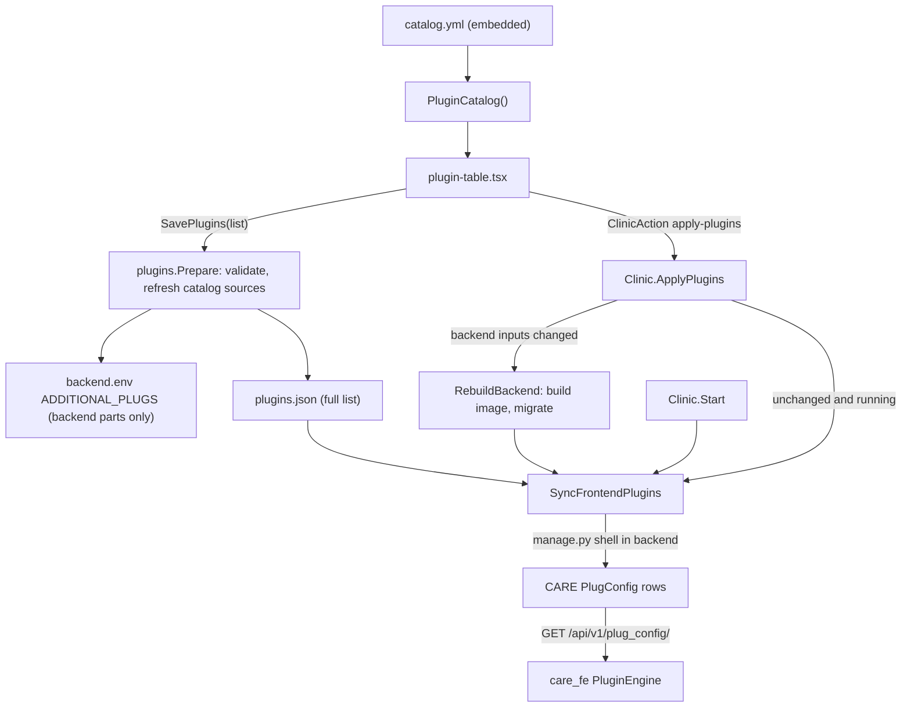

# Plugins

[Documentation index](README.md)

CARE Desktop lets operators add CARE plugins from a bundled catalog, or add custom ones, from the **Plugins** tab. No Desktop admin password is required to view, save or apply plugins. One click on **Save and apply** installs whatever the plugin needs, whether that's a backend part, a frontend part, or both. This includes custom plugin code, so access to the clinic computer should remain restricted to trusted staff.

This guide explains how CARE itself loads plugins, the catalog file format, every component on the desktop side, and how a save flows through them.

## How CARE loads plugins

A CARE plugin is up to two independent pieces that share a name.

| Part | What it is | How CARE loads it | When a change takes effect |
| --- | --- | --- | --- |
| Backend | A Django app, installed with pip. | CARE's `docker/prod.Dockerfile` reads the `ADDITIONAL_PLUGS` build argument and pip-installs `package_name + version` for each entry. At startup `plug_config.py` reads the same JSON: each `name` is appended to `INSTALLED_APPS`, `api/<name>/` is mounted on `<name>.urls`, and `configs` becomes `settings.PLUGIN_CONFIGS[name]`. Plugins read their settings from there first, then from environment variables, then from their defaults. | Only after the backend image is rebuilt. |
| Frontend | A Vite module-federation remote (`remoteEntry.js`), hosted anywhere. | care_fe's `PluginEngine` calls `GET /api/v1/plug_config/`, registers each row's `meta.url` as a federation remote under the row's `slug`, and loads its `./manifest`. The manifest contributes components, overrides, routes, and translations. Each row's `meta` is published to the plugin as `window.__CARE_PLUGIN_RUNTIME__.meta[slug]`. | Next page load. No rebuild needed. |

`PlugConfig` is a plain `slug` + `meta` JSON table in CARE (`care/users/models.py`). CARE's own `/admin/apps` page edits the same rows. The backend never reads this table; it exists only to tell the frontend what to load.

Staff browsers download a frontend plugin's bundle straight from its `url`. If that is a public host such as GitHub Pages, those computers need internet access for the plugin's screens to appear.

## The catalog: `catalog.yml`

[`app/internal/plugins/catalog.yml`](../app/internal/plugins/catalog.yml) lists the plugins offered in the **Add a plugin** menu. It is embedded into the binary with `go:embed`, so changing it requires a new CARE Desktop release. CARE Onboarding is enabled by default for new clinic installations only; booking notifications and Filly are opt-in.

### Structure

The file is a YAML list. Each item is one catalog entry:

```yaml
- description: One sentence shown under the plugin's name in the panel.
  default: false                 # opt in during new-clinic setup only
  plugin:
    id: care_example              # required, unique across the catalog
    label: Example                # name shown in the panel
    backend:                      # omit for a frontend-only plugin
      name: care_example          # Python module, goes into INSTALLED_APPS
      package_name: git+https://github.com/org/care_example.git
      version: "@main"            # appended to package_name; quote it
      configs:                    # default backend settings, editable in the panel
        EXAMPLE_API_KEY: ""
    frontend:                     # omit for a backend-only plugin
      slug: care_example_fe       # PlugConfig slug and federation remote name
      url: https://org.github.io/care_example_fe/assets/remoteEntry.js
      meta:                       # default frontend settings, editable as JSON
        config:
          EXAMPLE_API_URL: ""
```

### Field reference

| Field | Required | Meaning | Rules enforced on save |
| --- | --- | --- | --- |
| `description` | No | Subtitle in the panel. Not saved with the plugin. | None. |
| `default` | No | Enable during new-clinic setup. Defaults to `false`; never auto-added on upgrade or an ordinary read. | Boolean. |
| `plugin.id` | Yes | Identity of the plugin. Also how a saved plugin is matched back to its catalog entry. | Letters, numbers, `.`, `_`, `-`; unique. |
| `plugin.label` | No | Display name, such as `CARE Onboarding`. Falls back to `id`. | Spaces allowed; surrounding whitespace trimmed. |
| `plugin.backend` | One of `backend`/`frontend` | Present when the plugin has a Django part. | |
| `backend.name` | Yes | The importable Python module. A wrong value stops Django from starting. | Python dotted name; unique across plugins. |
| `backend.package_name` | Yes | Anything pip accepts: a PyPI name, `git+https://…`, or a URL. | Non-empty, no whitespace. |
| `backend.version` | No | Appended to `package_name` with no separator, e.g. `@main`, `@v1.2.0`, `==1.2`. CARE defaults to `@main` when empty. | Must start with `@`, `=`, `<`, `>`, `~` or `!`. |
| `backend.configs` | No | Map of setting name to value. Any YAML scalar, list, or map. Delivered as `settings.PLUGIN_CONFIGS[name]`. | None. |
| `plugin.frontend` | One of `backend`/`frontend` | Present when the plugin has a UI part. | |
| `frontend.slug` | Yes | `PlugConfig.slug`; also the federation remote name and default i18n namespace. | Letters, numbers, `_`, `-`; unique across plugins. |
| `frontend.url` | Yes | Absolute link to the plugin's `remoteEntry.js`. | `http` or `https` with a host. |
| `frontend.meta` | No | Extra keys merged into the `PlugConfig.meta` row. What goes here depends on the plugin. For example, Filly reads `meta.config.<KEY>`. | Must not contain `url`; set that in `frontend.url`. |

YAML reads an unquoted value that starts with `@` as an error, so always quote `version`. Values are converted to JSON before use, so write them as you want them to appear in `PLUGIN_CONFIGS` or `meta`.

### What the operator can and cannot change

For a plugin added from the catalog, the panel shows only its settings (`backend.configs` and `frontend.meta`). Everything else comes from the catalog: on every save, `Prepare` replaces `label`, `backend.name`, `backend.package_name`, `backend.version`, `frontend.slug`, `frontend.url`, and which parts exist with the current catalog entry, and keeps only the operator's settings.

As a result:

- Bumping a `version` or `url` in the catalog reaches existing clinics the next time an administrator saves plugins after updating CARE Desktop.
- Adding a frontend part to an existing catalog entry turns it on for those clinics at that same save, starting from the catalog's default `meta`.
- Removing an entry from the catalog does not uninstall it anywhere. The saved plugin becomes a custom plugin with the same sources.

### Adding a catalog entry

1. Confirm the backend module name by checking the plugin's `apps.py` (`AppConfig.name`) or its `PLUGIN_NAME`.
2. Confirm the backend installs with `pip install "<package_name><version>"`.
3. Confirm `url` returns the plugin's `remoteEntry.js`, not a 404 page.
4. List the settings the plugin needs under `configs` and `meta`, with empty or default values, so the operator sees what to fill in.
5. Run `go test ./internal/plugins`. `TestEveryCatalogEntryIsValid` fails if any entry breaks the save rules above.

## Desktop components



| Component | File | Responsibility |
| --- | --- | --- |
| Catalog | [`internal/plugins/catalog.yml`](../app/internal/plugins/catalog.yml) | The plugins on offer. |
| Plugin model and storage | [`internal/plugins/plugins.go`](../app/internal/plugins/plugins.go) | `Plugin`, `Backend`, `Frontend`, `CatalogEntry`; `Catalog()`, `Prepare()`, `Manager.ReadPlugins/SavePlugins/FrontendRows`; `ADDITIONAL_PLUGS` dotenv editing. |
| Engine steps | [`internal/clinic/plugins.go`](../app/internal/clinic/plugins.go) | `ApplyPlugins`, `SyncFrontendPlugins`, the Python sync script, and the running-backend check. |
| Image freshness | [`internal/compose/build.go`](../app/internal/compose/build.go) | `BackendImageCurrent` compares the backend image label with the source ref plus a hash of `ADDITIONAL_PLUGS`. |
| Startup and rebuild hooks | [`start.go`](../app/internal/clinic/start.go), [`rebuild.go`](../app/internal/clinic/rebuild.go) | Sync frontend rows after migrations; a failure is only a warning. |
| Bindings | [`app_plugins.go`](../app/app_plugins.go), [`app_actions.go`](../app/app_actions.go) | `ReadPlugins`, `SavePlugins`, `PluginCatalog`; the `apply-plugins` action. |
| Panel | [`plugin-table.tsx`](../app/frontend/src/screens/panel/plugin-table.tsx) | Catalog picker, custom plugin editor, settings editors, save. |
| Types | [`types.ts`](../app/frontend/src/types.ts), [`wails.d.ts`](../app/frontend/src/wails.d.ts) | `CarePlugin`, `PluginBackend`, `PluginFrontend`, `PluginCatalogEntry`. |
| Tests | [`plugins_test.go`](../app/internal/plugins/plugins_test.go) | Dotenv round trip, legacy migration, backend/frontend split, validation, catalog refresh, frontend rows, catalog validity. |

### `plugins.json`

The saved list lives in `plugins.json` in the install directory, next to `backend.env`. It uses mode `0600` and is replaced atomically. It is the source of truth: `ADDITIONAL_PLUGS` and the `PlugConfig` rows are both derived from it. Each item has the same shape as `plugin` in the catalog, plus `catalog: true` when it came from the catalog.

When the file does not exist, `ReadPlugins` builds the list from `ADDITIONAL_PLUGS`. Each entry becomes a backend-only custom plugin. This carries over installations from before the file existed. The first save writes the file.

New-clinic `Clinic.Setup` calls `InitializeDefaults` before building images. If `plugins.json` is absent, it preserves those legacy backend entries, adds catalog entries marked `default: true` (without replacing an existing ID), and persists the list. If a list already exists, it is left untouched, including an empty list. Reads, restarts, rebuilds and upgrades never initialize defaults. Existing clinics must explicitly add CARE Onboarding; removing it and saving keeps it removed.

CARE Onboarding uses the hosted GitHub Pages remote with `{"config":{"auto_onboarding":true}}`. Automatic pre-login setup also requires compatible CARE frontend/backend builds; see [facility setup](onboarding.md#care-compatibility-and-startup).

### `ADDITIONAL_PLUGS`

`SavePlugins` writes only the backend parts to `ADDITIONAL_PLUGS`, as `[{name, package_name, version?, configs?}]` wrapped in single quotes so dotenv does not expand values. Frontend data never goes there, because CARE builds a strict dataclass from each entry and an unknown key would crash the backend at startup. Unrelated lines are preserved, duplicate assignments (including `export` forms) are removed, the result is re-parsed before it is written, and an empty list removes the variable. The settings editor refuses to edit `ADDITIONAL_PLUGS` directly.

### Frontend rows

`FrontendRows` turns every frontend part into one `PlugConfig` row:

```json
{
  "care_filly_fe": {
    "name": "care_filly_fe",
    "config": { "MEDISPEAK_API_URL": "https://…" },
    "url": "https://…/remoteEntry.js",
    "managed_by": "care-desktop"
  }
}
```

`name` defaults to the slug and can be overridden in `meta`. `url` and `managed_by` always come from Desktop.

`SyncFrontendPlugins` runs `python manage.py shell -c <script>` in the backend container. The rows are passed through the `CARE_DESKTOP_FRONTEND_PLUGINS` environment variable, so settings never appear in command arguments or the log. The script:

1. Upserts each row by slug.
2. Deletes rows with `meta.managed_by == "care-desktop"` that are no longer in the list.
3. Clears CARE's `care_plug_viewset_list` cache so the next page load sees the change.
4. Prints how many rows were registered and removed.

Rows created by hand in CARE's `/admin/apps` are never touched unless they share a slug with a desktop plugin; in that case the desktop's version wins.

## Save and apply

The panel calls `SavePlugins(list)`, which validates and persists, and then `ClinicAction("apply-plugins")`. Both require a stable installed server clinic (no unfinished restore), but neither requires a Desktop admin password. Explicit rebuild actions remain password-protected. `ApplyPlugins` then:

1. Recovers any pending restore.
2. If `BackendImageCurrent` is false, runs `RebuildBackend`: build, stop workers, start backend, migrate, sync frontend rows, restart workers.
3. Otherwise, if the backend container is not running, logs that plugins apply at the next start and returns.
4. Otherwise syncs frontend rows. Here a sync failure fails the action.

So a change to frontend parts only takes a few seconds, and a change to any backend part takes a full backend rebuild.

`Start` and `RebuildBackend` also sync after migrations. There a failure is only logged as a warning, because a missing plugin screen is less harmful than a clinic that will not start. Syncing on every start also repairs rows after a database restore or a hand edit in CARE's admin.

## The panel

- **Add a plugin** lists catalog entries whose plugin ID, backend module and frontend name are not already in the list, then **Custom plugin**. This includes custom entries using the same identities. A newly added plugin opens expanded.
- Each plugin shows **Backend**, **Frontend**, and **Custom** badges as they apply, and a remove button. Removing a plugin and saving uninstalls both parts: the backend is rebuilt without it and its `PlugConfig` row is deleted.
- **Backend settings** are key/value rows. `true`/`false`, integers, decimals, and text starting with `[` or `{` (parsed as JSON) are converted to the matching type; anything else stays a string.
- **Frontend settings** are the raw `meta` JSON object, the same format as CARE's `/admin/apps` editor. Invalid JSON, or a value that is not an object, disables saving.
- **Custom plugins** show a **Display name** (spaces allowed) separately from the required **Plugin ID** (letters, numbers, `.`, `_`, `-`; no spaces). Invalid or duplicate IDs have inline errors and block saving. They also show a switch for each part, the backend module, pip source and version, and the frontend name and `remoteEntry.js` URL.

## Troubleshooting

| Symptom | Likely cause |
| --- | --- |
| Backend will not start after saving | `backend.name` does not match the installed module, or the plugin's own startup checks failed. Check the log for `ModuleNotFoundError`, fix or remove the plugin, and save again. |
| Rebuild fails during `pip install` | Wrong `package_name`/`version`, a private repository, or no internet during the build. |
| Plugin UI does not appear | The browser cannot reach `frontend.url`, the URL is not a `remoteEntry.js`, or the log shows the sync warning. The browser console names the slug that failed. |
| A setting has no effect | Backend settings apply only after the rebuild that saving triggers. Frontend settings apply on the next page load. Check that the key is what the plugin actually reads. |
